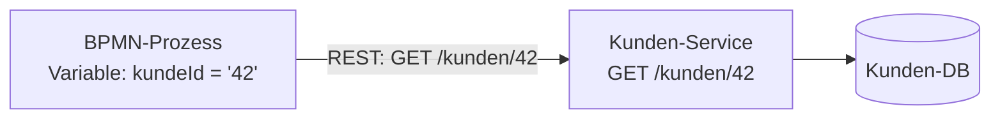
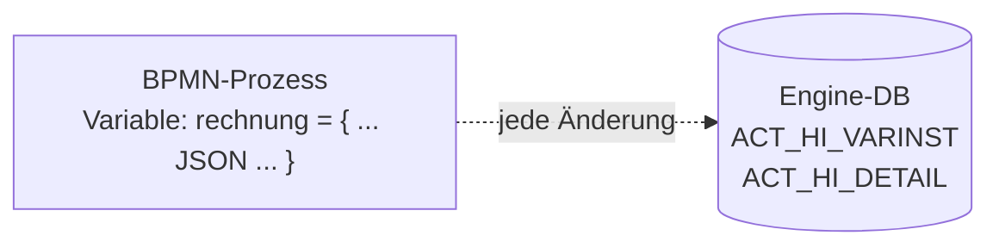
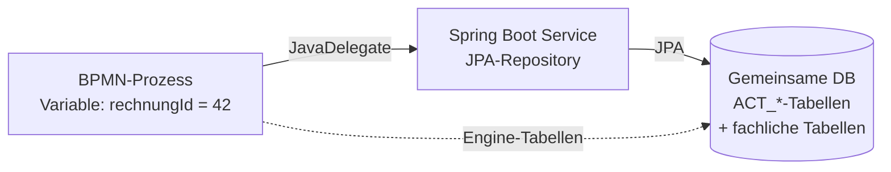

# Daten in BPMN Prozessen

Eine zentrale Frage bei jedem BPMN-Prozess: **Wo liegen die fachlichen Daten, und wie kommt der Prozess an sie heran?** Die Process Engine speichert Prozessvariablen in ihrer eigenen Datenbank. Fachliche Daten – Kunden, Anträge, Rechnungen – gehören aber in der Regel in spezialisierte [Microservices](../technik/microservices). Dafür gibt es mehrere Muster mit unterschiedlichen Trade-offs.

Diese Seite stellt die Optionen vor, beginnend mit der einfachsten: **Referenzen über IDs**.

---

## Option 1: Referenzen über IDs

Die Process Engine speichert nur die **ID** eines fachlichen Objekts als Prozessvariable. Das vollständige Objekt liegt im zuständigen Microservice und wird bei Bedarf über dessen REST-API geladen.



### Vorteile

- **Single Source of Truth.** Der fachliche Microservice bleibt die einzige Quelle. Änderungen landen nicht in veralteten Prozessvariablen.
- **Schlanke Engine.** Die Process Engine speichert nur kleine Strings/Zahlen statt großer Objekte. Das hält Tabellen wie `ACT_RU_VARIABLE` klein und die Engine performant.
- **Lose Kopplung.** Der Prozess kennt nur die Schnittstelle des Microservices, nicht dessen internes Datenmodell.

### Nachteile

- **Mehr REST-Calls.** Jeder Schritt, der Daten braucht, lädt sie potenziell neu.
- **Verfügbarkeit.** Ist der Microservice nicht erreichbar, kommt auch der Prozess nicht weiter.

### Wenn das volle Objekt gebraucht wird: ExecutionListener

In einer User Task soll dem Sachbearbeiter der **komplette Kunde** angezeigt werden, nicht nur dessen ID. Statt das in jedem Aufruf zu wiederholen, lässt sich das Laden über einen [ExecutionListener](https://docs.cibseven.org/manual/2.1-ee/user-guide/process-engine/delegation-code/#execution-listener) automatisieren. Ein ExecutionListener läuft an einem definierten Zeitpunkt – hier am **`start`-Event** der Activity – und kann dort Prozessvariablen lesen und schreiben.

#### Java-Implementierung

```java
package de.winfprojekt.process.listener;

import org.camunda.bpm.engine.delegate.DelegateExecution;
import org.camunda.bpm.engine.delegate.ExecutionListener;
import org.springframework.beans.factory.annotation.Autowired;
import org.springframework.stereotype.Component;
import org.springframework.web.client.RestClient;

@Component("loadKundeListener")
public class LoadKundeListener implements ExecutionListener {

    @Autowired
    private RestClient kundeClient; // konfiguriert mit Base-URL des Kunden-Service

    @Override
    public void notify(DelegateExecution execution) {
        String kundeId = (String) execution.getVariable("kundeId");
        if (kundeId == null) {
            return;
        }
        Kunde kunde = kundeClient.get()
            .uri("/kunden/{id}", kundeId)
            .retrieve()
            .body(Kunde.class);
        execution.setVariable("kunde", kunde);
    }
}
```

`Kunde` ist hier ein einfaches POJO (Record oder Klasse) mit den Feldern, die der Microservice als JSON liefert. Jackson übernimmt die Deserialisierung automatisch.

#### BPMN-Einbindung

In der `.bpmn`-Datei wird der Listener als Extension Element an der User Task konfiguriert:

```xml
<bpmn:userTask id="Task_KundePruefen" name="Kunde prüfen">
  <bpmn:extensionElements>
    <camunda:executionListener
        delegateExpression="${loadKundeListener}"
        event="start" />
  </bpmn:extensionElements>
</bpmn:userTask>
```

Im Camunda Modeler: User Task auswählen → Properties Panel → Tab _Listeners_ → _Execution Listener_ hinzufügen → Event `start` → Type `Delegate Expression` → Expression `${loadKundeListener}`.


#### Variante: Class statt Delegate Expression

```xml
<camunda:executionListener
    class="de.winfprojekt.process.listener.LoadKundeListener"
    event="start" />
```

Mit `class` instanziiert die Engine das Objekt selbst – ohne Spring-Kontext, also ohne Dependency Injection. Mit `delegateExpression` wird eine bestehende Spring-Bean referenziert; das ist hier der bevorzugte Weg, weil REST-Client, Konfiguration und Logger sauber injiziert werden.

#### Ergebnis im Prozess

Nach dem `start`-Event steht im weiteren Verlauf der Task die Variable `kunde` als vollständiges Objekt zur Verfügung. Über `${kunde.name}` lässt sich z. B. der Name im Task-Formular einbinden. Soll das volle Objekt nicht weiter mitgeführt werden, kann ein zweiter Listener am `end`-Event die Variable wieder entfernen:

```java
execution.removeVariable("kunde");
```

:::tip[Lazy Loading]
Den Listener nur an den Schritten registrieren, an denen das volle Objekt wirklich gebraucht wird. So entstehen keine unnötigen REST-Calls in Schritten, die nur mit der ID arbeiten.
:::

:::warning[Stand der Daten]
Die geladene Kopie ist nur zum Zeitpunkt des `start`-Events aktuell. Ändert sich der Kunde während der Task im Microservice, sieht der Sachbearbeiter den älteren Stand. Bei langen Wartezeiten ggf. zusätzlich vor dem Abschließen der Task neu laden.
:::

---

## Option 2: Daten als (JSON-)Prozessvariable mitführen

Statt nur einer ID wird das **vollständige Objekt** als JSON in einer Prozessvariable abgelegt. Die Engine speichert es serialisiert in `ACT_RU_VARIABLE` und – durch die History – auch in `ACT_HI_VARINST` bzw. `ACT_HI_DETAIL`. Damit wandert das Objekt mit dem Prozess durch alle Schritte und ist auch nach Prozessende noch über die History API abrufbar.



### Beispiel: Rechnung als Prozessvariable

```java
ObjectValue rechnungValue = Variables
    .objectValue(rechnung)
    .serializationDataFormat(Variables.SerializationDataFormats.JSON)
    .create();

runtimeService.startProcessInstanceByKey(
    "rechnungFreigabe",
    Map.of("rechnung", rechnungValue)
);
```

Im Prozess steht die Rechnung dann als typisierte Variable zur Verfügung – inkl. Zugriff per Expression im Modeler:

```xml
<bpmn:userTask id="Task_Freigabe" name="Rechnung über ${rechnung.betrag} € freigeben" />
```

### Variante: Variablen beim Start aus der UI setzen

Wird der Prozess direkt aus dem [Frontend](../technik/frontend) angestoßen, lässt sich das vollständige Objekt im Start-Request an die [Engine-REST-API](https://docs.cibseven.org/manual/2.1-ee/reference/rest/process-definition/post-start-process-instance/) übergeben. Der Nutzer hat die Rechnung im Formular zusammengestellt – mit dem Absenden wandert sie als unveränderlicher Snapshot in den Prozess.

Roh als HTTP-Request sieht der Aufruf so aus – inklusive des JWT, das die UI von [Keycloak](../technik/oauth2-oidc) erhalten hat:

```bash
curl -X POST https://cibseven.winfprojekt.de/engine-rest/process-definition/key/rechnungFreigabe/start \
  -H "Authorization: Bearer ${JWT}" \
  -H "Content-Type: application/json" \
  -d '{
    "variables": {
      "rechnung": {
        "value": "{\"nummer\":\"R-2026-0042\",\"betrag\":1499.00,\"empfaenger\":\"ACME GmbH\"}",
        "type": "Json"
      }
    }
  }'
```

Aus dem React-Frontend wird daraus mit `fetch` und `keycloak.token` (siehe [Frontend-Seite](../technik/frontend#token-an-api-requests-anhängen)):

```ts
const rechnung = {
  nummer: 'R-2026-0042',
  betrag: 1499.00,
  empfaenger: 'ACME GmbH',
  positionen: [
    { bezeichnung: 'Beratung', menge: 10, einzelpreis: 149.90 },
  ],
};

await keycloak.updateToken(30);

await fetch(
  `${import.meta.env.VITE_CIBSEVEN_URL}/engine-rest/process-definition/key/rechnungFreigabe/start`,
  {
    method: 'POST',
    headers: {
      Authorization: `Bearer ${keycloak.token}`,
      'Content-Type': 'application/json',
    },
    body: JSON.stringify({
      variables: {
        rechnung: {
          value: JSON.stringify(rechnung),
          type: 'Json',
        },
      },
    }),
  },
);
```

Der Variablentyp `"Json"` weist die Engine an, den Wert als JSON-Objekt zu hinterlegen – Expressions wie `${rechnung.betrag}` funktionieren in nachgelagerten Tasks dann ohne weitere Konfiguration.

So liegt der "Owner" der Daten zum Startzeitpunkt im UI-Formular, und der Prozess hält die fixierte Version anschließend als Snapshot fest.

### Vorteile

- **Audit Trail kostenlos.** Jede Änderung an der Variable landet automatisch in der History und ist über Cockpit oder die History API einsehbar. Wer wann was am Objekt geändert hat, ist nachvollziehbar.
- **Snapshot des Zustands.** Die Daten sind genau so dokumentiert, wie sie zum Zeitpunkt des Schritts waren – auch wenn sich die Welt drumherum längst weiterbewegt hat.
- **Keine externen Calls.** Der Prozess läuft auch dann weiter, wenn andere Services gerade nicht erreichbar sind.

### Nachteile

- **Nur sinnvoll für statische bzw. immutable Daten.** Sobald die Daten woanders "geowned" werden und sich dort ändern können, verliert die Kopie ihre Aktualität und es entstehen zwei konkurrierende Wahrheiten.
- **Engine-Datenbank wächst.** Große JSON-Strukturen in vielen Prozessinstanzen blähen `ACT_RU_VARIABLE` und die History-Tabellen auf.
- **Schema-Drift.** Ändert sich das DTO der Klasse, müssen alte serialisierte Stände weiterhin lesbar bleiben – sonst scheitern laufende Prozesse beim Deserialisieren.

### Wann passt das?

Diese Option ist die richtige Wahl, wenn die Daten **zum Zeitpunkt des Prozessstarts festgeschrieben** sind und sich konzeptionell nicht mehr ändern sollen – etwa:

- eine **freigegebene Rechnung** mit Betrag, Positionen und Empfänger
- ein **Vertragsentwurf**, der durch den Prozess seine endgültige Form findet
- ein **Antrag**, dessen Inhalt der Antragsteller beim Start fixiert hat

Sobald der "Owner" der Daten außerhalb des Prozesses liegt und die Daten sich dort weiterentwickeln, ist [Option 1](#option-1-referenzen-über-ids) die robustere Wahl.

:::tip[Kombinieren]
Beide Optionen schließen sich nicht aus. Eine ID (`kundeId`) referenziert den lebendigen, sich ändernden Kunden-Stammsatz; ein eingefrorenes JSON (`rechnungsdaten`) hält den unveränderlichen Stand der Rechnung im Prozess fest.
:::

---

## Option 3: Eigene Prozess-Datenbank im Service

Die dritte Variante: Der Service, der den Prozess enthält, bekommt **eine eigene Datenbank** mit eigenen JPA-Entities. Die Engine teilt sich diese Datenbank mit der fachlichen Anwendung – Prozessvariablen halten nur IDs auf die fachlichen Entities, die in derselben DB liegen. Aus einer `JavaDelegate` oder einem ExecutionListener kann direkt per Repository auf die Entities zugegriffen werden, ohne den Umweg über REST.



### Beispiel

```java
@Component("ladeRechnung")
public class LadeRechnung implements JavaDelegate {

    @Autowired
    private RechnungRepository rechnungen;

    @Override
    public void execute(DelegateExecution execution) {
        Long rechnungId = (Long) execution.getVariable("rechnungId");
        Rechnung rechnung = rechnungen.findById(rechnungId).orElseThrow();
        execution.setVariable("betrag", rechnung.getBetrag());
    }
}
```

Kein REST-Call, keine Serialisierung – nur ein JPA-Lookup in derselben Transaktion, in der auch die Engine ihre Tabellen schreibt.

### Vorteile

- **Transaktionale Konsistenz.** Engine und Fachlogik schreiben in einer einzigen DB-Transaktion. Entweder gehen Prozessschritt und Datenänderung beide durch oder gar nicht.
- **Einfacher Zugriff.** Keine HTTP-Clients, keine Retries, keine Serialisierung – nur Repositories.
- **Schneller.** Kein Netzwerk-Hop zwischen Engine und Fachdaten.

### Nachteile

- **Bricht die [Microservice-Architektur](../technik/microservices).** Die fachlichen Daten leben im selben Container, im selben Spring-Kontext, in derselben Datenbank wie die Engine. Andere Services können nur über REST darauf zugreifen, der eigene Service umgeht dies – das schafft Sonderwege.
- **Engine-DB und Fachdaten-DB sind gekoppelt.** Ein Schema-Update auf einer Seite kann die andere beeinflussen. Backup, Migration und Skalierung müssen für beide gemeinsam gedacht werden.
- **Nicht beliebig kombinierbar.** Sobald mehrere Services Prozesse hosten oder die zentrale Engine genutzt wird, funktioniert dieses Muster nicht mehr – die zentrale Engine hat keinen Zugriff auf die JPA-Entities der einzelnen Services.

### Bewertung

:::danger[Kein Best Practice für dieses Projekt]
Diese Variante ist **kein empfohlenes Muster** für das Projekt. Sie funktioniert nur in einer **monolithischen Spring-Boot-Anwendung**, in der genau ein Service sowohl die Engine als auch die fachliche Domäne enthält und beide eine gemeinsame Datenbank teilen.

Da die Architektur hier auf [eigenständige Microservices](../technik/microservices) und eine **zentrale CIB-seven-Instanz** setzt (siehe [CIB seven](../technik/cibseven)), bleibt für Prozessdaten in der Regel die Kombination aus [Option 1](#option-1-referenzen-über-ids) (Referenzen via ID) und [Option 2](#option-2-daten-als-json-prozessvariable-mitführen) (Snapshots als JSON) die richtige Wahl.
:::

Erwähnt sei die Option dennoch, weil sie in vielen Camunda-Tutorials und älteren Beispielen auftaucht – und weil sie für sehr kleine Anwendungen oder Prototypen pragmatisch sein kann.
