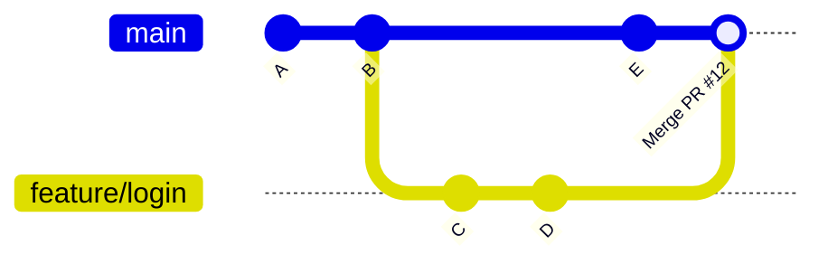
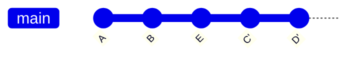
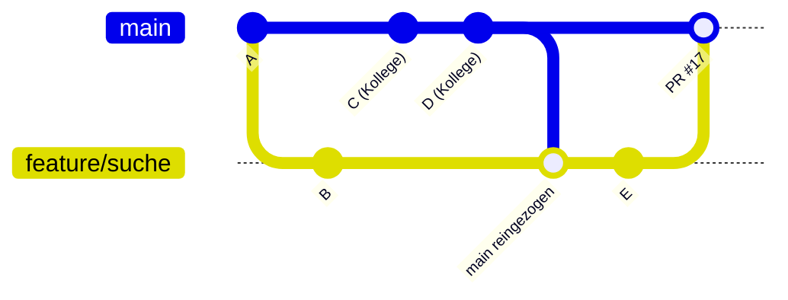

# Branches und Pull Requests

Niemand arbeitet direkt auf `main`. Stattdessen bekommt jedes Feature oder jeder Bugfix einen eigenen Branch, eine isolierte Arbeitskopie, die erst nach Review in `main` landet.

:::warning[Kein Fork]
Wir arbeiten **nicht** mit Forks. Das Repository wird einmalig geklont, alle Branches werden direkt im gemeinsamen Repository erstellt und gepusht. Pull Requests entstehen aus Branches, nicht aus Forks.
:::

## Ein Feature entwickeln

Der Ausgangspunkt ist immer ein GitHub Issue. Daraus entsteht ein Branch, auf dem die Änderung entwickelt wird. Ist die Arbeit fertig, wird ein Pull Request geöffnet, der den Dozenten zum Review einlädt. Nach dem Review wird der PR gemerged oder rebased, je nachdem, was die sauberere Historie ergibt.

**Ablauf:**

1. Issue in GitHub erstellen (oder ein bestehendes aufgreifen)
2. Branch von `main` erstellen, z. B. `feature/login` oder `fix/token-expiry`
3. Änderungen committen und den Branch pushen
4. Pull Request öffnen und im PR-Text auf das Issue verweisen (`Closes #12`)
5. Dozent reviewed und integriert den PR per Merge oder Rebase

## Merge vs. Rebase

Beide Strategien bringen die Änderungen eines Branches in `main`, aber sie hinterlassen unterschiedliche Historien.

### Merge

Beim Merge bleibt die Branch-Geschichte vollständig erhalten. Ein zusätzlicher Merge-Commit verbindet die beiden Historien.



Sinnvoll, wenn die Entwicklung auf dem Branch als zusammenhängende Einheit sichtbar bleiben soll, z. B. bei größeren Features mit mehreren Commits, die gemeinsam nachvollziehbar sein sollen.

### Rebase

Beim Rebase werden die Commits des Branches so umgeschrieben, als wären sie direkt auf dem aktuellen `main` entstanden. Es entsteht eine lineare Historie ohne Merge-Commit.



Sinnvoll bei kleinen, sauberen Branches mit wenigen Commits, die thematisch zusammenpassen und die `main`-Historie nicht mit Merge-Commits belasten sollen.

### Wann was?

| Situation | Strategie |
|-----------|-----------|
| Größeres Feature, mehrere Commits, soll als Einheit erkennbar bleiben | Merge |
| Kleiner, überschaubarer Branch mit 1-3 sauberen Commits | Rebase |
| Branch hat viele Zwischen-Commits ("WIP", "fix fix") | Rebase (bereinigt die Historie) |
| Parallele Arbeit mehrerer Personen auf demselben Branch | Merge (Rebase würde fremde Commits umschreiben) |

## Änderungen von Kollegen holen

Während man am eigenen Branch arbeitet, entwickelt sich `main` weiter. Damit der eigene Branch nicht zu weit abweicht, holt man sich regelmäßig den aktuellen Stand, ebenfalls per Merge oder Rebase.



**Per Merge** (einfach, sicher):
```bash
git checkout main && git pull
git checkout feature/suche
git merge main
```

**Per Rebase** (lineare Historie, etwas aufwendiger):
```bash
git checkout main && git pull
git checkout feature/suche
git rebase main
```

Beim Rebase werden die eigenen Commits auf die Spitze von `main` umgeschrieben. Konflikte müssen commit-weise aufgelöst werden (`git rebase --continue`). Danach muss der Branch force-gepusht werden (`git push --force-with-lease`), da die Commit-Hashes sich geändert haben.

## Technische Umsetzung

Wie das Repository strukturiert ist, welche GitHub Actions laufen und wie das Deployment funktioniert, ist in der [Technik-Seite zu GitHub](../technik/github) beschrieben.

## Warum nicht direkt auf main?

- `main` ist immer deploybar, fehlerhafte Stände kommen nicht rein
- Änderungen werden reviewed, bevor sie für alle sichtbar sind
- Paralleles Arbeiten ist möglich, ohne sich gegenseitig zu blockieren
