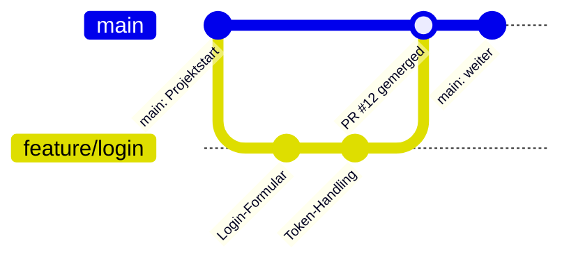
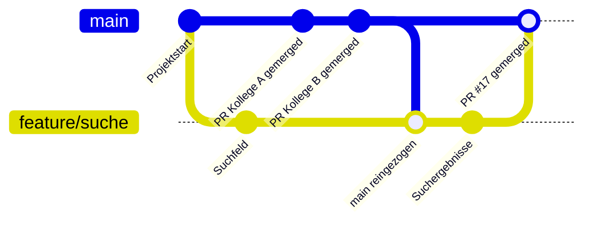

# Branches und Pull Requests

Niemand arbeitet direkt auf `main`. Stattdessen bekommt jedes Feature oder jeder Bugfix einen eigenen Branch — eine isolierte Arbeitskopie, die erst nach Review in `main` landet.

## Ein Feature entwickeln

Der Ausgangspunkt ist immer ein GitHub Issue. Daraus entsteht ein Branch, auf dem die Änderung entwickelt wird. Ist die Arbeit fertig, wird ein Pull Request geöffnet, der den Dozenten zum Review einlädt. Nach dem Merge ist der Stand auf `main` und der Branch wird gelöscht.



**Ablauf:**

1. Issue in GitHub erstellen (oder ein bestehendes aufgreifen)
2. Branch von `main` erstellen, z. B. `feature/login` oder `fix/token-expiry`
3. Änderungen committen und den Branch pushen
4. Pull Request öffnen und im PR-Text auf das Issue verweisen (`Closes #12`)
5. Dozent reviewed und mergt den PR

## Änderungen von Kollegen holen

Während man am eigenen Branch arbeitet, entwickelt sich `main` weiter — andere PRs werden gemerged. Damit der eigene Branch nicht zu weit abweicht, holt man sich regelmäßig den aktuellen Stand von `main`.



```bash
git checkout main
git pull
git checkout feature/suche
git merge main
```

Konflikte, die dabei entstehen, werden lokal gelöst, bevor die Arbeit weitergeht.

## Warum nicht direkt auf main?

- `main` ist immer deploybar — fehlerhafte Stände kommen nicht rein
- Änderungen werden reviewed, bevor sie für alle sichtbar sind
- Paralleles Arbeiten ist möglich, ohne sich gegenseitig zu blockieren
