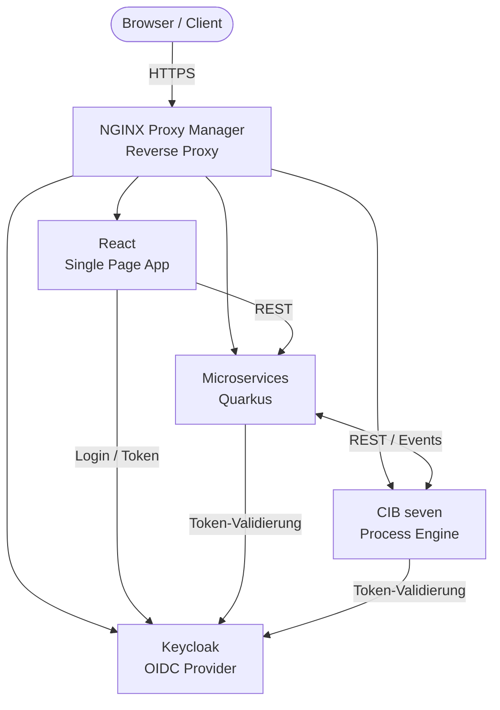

# Systemarchitektur

Das System besteht aus mehreren spezialisierten Komponenten, die als Container betrieben und über einen zentralen Reverse Proxy erreichbar gemacht werden.

## Übersicht

## Komponenten

### [NGINX Proxy Manager](https://nginxproxymanager.com/) Reverse Proxy

Der NGINX Proxy Manager ist der einzige öffentlich erreichbare Endpunkt. Er nimmt alle eingehenden HTTPS-Anfragen entgegen und leitet sie anhand von Subdomain-Regeln an den zuständigen Container weiter. Dadurch sind die internen Dienste nicht direkt exponiert. Die Konfiguration der Proxy-Hosts, SSL-Zertifikate (Let's Encrypt) und Weiterleitungen erfolgt über eine Weboberfläche — ohne manuelle nginx-Konfigurationsdateien.

### [React](https://react.dev/) Frontend

Die Benutzeroberfläche ist eine Single Page Application auf Basis von React. Sie kommuniziert ausschließlich über die REST-APIs der Microservices mit dem Backend. Die Authentifizierung läuft über Keycloak: Nach dem Login speichert die App das JWT und schickt es bei jedem API-Aufruf als Bearer-Token mit.

### [Keycloak](https://www.keycloak.org/) OIDC Provider

Keycloak übernimmt die zentrale Authentifizierung und Autorisierung nach dem OpenID-Connect-Standard. Nach erfolgreichem Login erhält der Client ein JWT, das bei jedem API-Aufruf mitgeschickt wird. Alle Microservices und CIB seven validieren dieses Token direkt gegen Keycloak.

### [CIB seven](https://cibseven.org/en/) Process Engine

CIB seven ist ein Fork von Camunda 7 und stellt die BPMN-Prozess-Engine bereit. Geschäftsprozesse werden als BPMN-Diagramme modelliert und von CIB seven ausgeführt. Die Microservices können Prozessinstanzen starten, Tasks abarbeiten und Prozessvariablen lesen und schreiben.

### Microservices ([Quarkus](https://quarkus.io/))

Die fachliche Logik ist auf spezialisierte Microservices aufgeteilt, die jeweils mit Quarkus implementiert sind. Quarkus bietet kurze Startup-Zeiten und geringen Speicherbedarf, was den Container-Betrieb vereinfacht. Die Microservices kommunizieren mit der Process Engine über deren REST-API und sichern ihre eigenen Endpunkte mit den von Keycloak ausgestellten Tokens ab.
