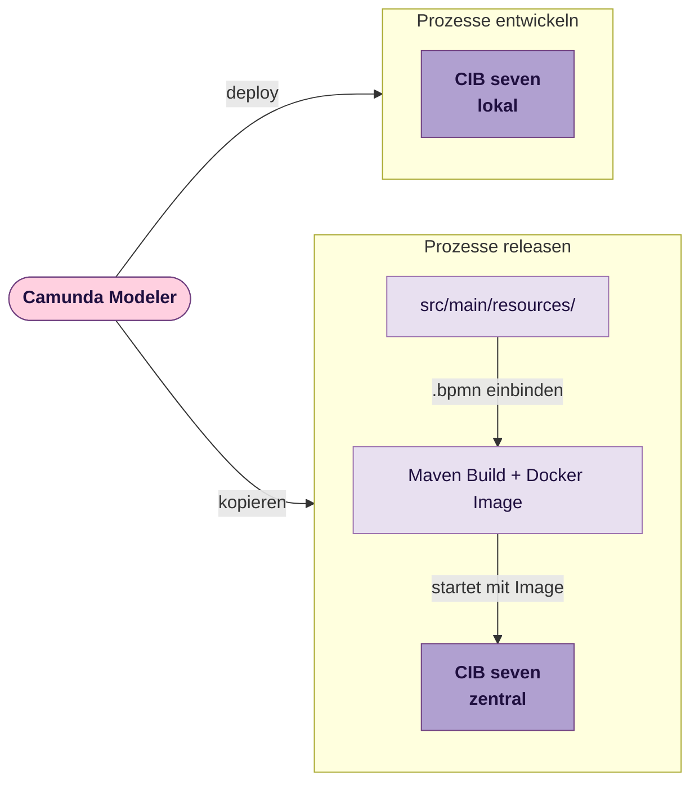

# CIB seven

[CIB seven](https://cibseven.org/en/) ist eine Open-Source-Prozess-Engine auf Basis von Camunda 7 und führt BPMN-Prozesse aus. Der Entwicklungsworkflow ist in zwei Phasen unterteilt: lokal entwickeln und testen, dann sauber releasen.



---

## Prozesse entwickeln

Für die lokale Entwicklung läuft CIB seven als Docker-Container. Prozesse werden mit dem Camunda Modeler als BPMN-Diagramme modelliert und direkt in die lokale Engine deployed. Eine schrittweise Einführung bietet die offizielle [Quick-Start-Dokumentation](https://docs.cibseven.org/get-started/quick-start/deploy/).

### Setup

Das offizielle Docker-Setup steht unter [cibseven/cibseven-docker](https://github.com/cibseven/cibseven-docker) bereit:

```bash
docker run -d --name cibseven -p 8080:8080 cibseven/cibseven:latest
```

Danach sind die Weboberflächen erreichbar unter:

| Oberfläche | URL |
|---|---|
| Tasklist | http://localhost:8080/webapp/tasklist |
| Cockpit | http://localhost:8080/webapp/cockpit |
| Admin | http://localhost:8080/webapp/admin |
| REST API | http://localhost:8080/engine-rest |

Standardzugangsdaten: `demo` / `demo`

### BPMN modellieren

Prozesse werden mit dem [Camunda Modeler](https://camunda.com/download/modeler/) als `.bpmn`-Dateien erstellt. Der Modeler läuft lokal und kann Prozesse direkt in eine laufende Engine deployen (Deploy-Button → `http://localhost:8080/engine-rest`).

---

## Prozesse releasen

Wenn ein Prozess lokal stabil ist, wird die fertige `.bpmn`-Datei in die zentrale Process Engine eingespielt. Alle Prozesse laufen gemeinsam in einer gemeinsam genutzten CIB-seven-Instanz. Als Seed für diese zentrale Process Engine steht [d135-1r43/cibseven-template](https://github.com/d135-1r43/cibseven-template) als **Template-Repository** bereit; die Keycloak-Anbindung ist darin bereits vorkonfiguriert (siehe [OAuth2/OIDC](./oauth2-oidc)). Wie das Docker-Image gebaut und deployed wird, beschreibt die [Deployment-Seite](./deployment).

1. Die fertige `.bpmn`-Datei nach `src/main/resources/` kopieren.
2. Den Service lokal bauen und testen:
   ```bash
   docker compose up -d        # Keycloak starten
   mvn spring-boot:run         # Service starten → http://localhost:8080
   ```
3. Die Version in der `pom.xml` auf das gewünschte Release setzen, z. B. `1.0.0`.
4. Einen Git-Tag mit `v`-Präfix setzen und pushen:
   ```bash
   git tag v1.0.0
   git push origin v1.0.0
   ```

Die CI/CD-Pipeline baut daraufhin automatisch ein Docker-Image und veröffentlicht es in der GitHub Container Registry mit dem passenden Semver-Tag (`1.0.0`).

### Versionierung

Für die zentrale Process Engine verwenden wir auch [Semantic Versioning](./semver). 