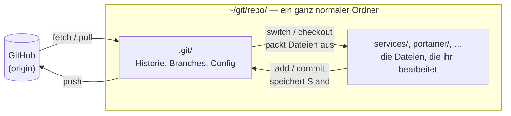

import Tabs from '@theme/Tabs';
import TabItem from '@theme/TabItem';

# Der Checkout ist nur ein Ordner

Die meisten Probleme mit Git im Projekt haben nichts mit Branches, Merges oder Konflikten zu tun. Sie entstehen, weil unklar ist, **wo** auf der Festplatte gerade gearbeitet wird: Es gibt drei Kopien des Repositories, IntelliJ zeigt die eine, das Terminal steht in der anderen, und gepusht wurde aus der dritten.

Diese Seite erklärt, was ein Checkout eigentlich ist, und warum IntelliJ das leicht verschleiert.

## Zwei Bedeutungen von „Checkout“

Das Wort wird für zwei verschiedene Dinge benutzt, und das ist bereits die erste Quelle der Verwirrung:

| Bedeutung | Befehl | Was passiert |
|---|---|---|
| **Der Checkout** (Klon, Arbeitskopie) | `git clone` | Ein neuer Ordner wird auf eurer Festplatte angelegt |
| **Etwas auschecken** (Branch wechseln) | `git switch` bzw. `git checkout` | Die Dateien in einem **bestehenden** Ordner werden ausgetauscht |

`git clone` macht man **einmal**. Einen Branch wechselt man ständig, dafür braucht es keinen neuen Ordner.

## Was `git clone` wirklich tut

```bash
git clone git@github.com:<org>/<repo>.git
```

Das ist alles, was dabei passiert:

1. Im aktuellen Verzeichnis wird ein Ordner `<repo>` angelegt.
2. Darin entsteht ein versteckter Unterordner `.git`, in den die komplette Historie des Repositories heruntergeladen wird.
3. Der Stand von `main` wird aus `.git` in den Ordner ausgepackt, damit ihr die Dateien bearbeiten könnt.
4. In `.git/config` wird notiert, woher das Repository stammt (das sogenannte Remote `origin`).

Das war es. Es gibt keine Registrierung beim Betriebssystem, keinen Hintergrunddienst, keine Datenbank und keine dauerhafte Verbindung zu GitHub. Git merkt sich nirgendwo zentral, dass ihr einen Klon habt.



Daraus folgen ein paar Dinge, die man sich einmal klarmachen sollte:

- **Das Repository ist der Ordner `.git`.** Alles daneben ist nur die aktuell ausgepackte Arbeitskopie.
- **Kopiert ihr den Ordner, habt ihr zwei unabhängige Repositories.** Sie wissen nichts voneinander.
- **Verschiebt ihr den Ordner, funktioniert Git danach genauso.** Git hat keine Pfade gespeichert, die dadurch kaputtgehen.
- **Löscht ihr den Ordner, ist alles weg,** was noch nicht gepusht wurde: lokale Commits, lokale Branches, nicht committete Änderungen.
- **Ein Commit landet nur in diesem einen Ordner.** Auf GitHub (und bei euren Teamkollegen) kommt er erst mit `git push` an.

:::warning[ZIP-Download ist kein Checkout]
Der Button *Code → Download ZIP* auf GitHub liefert nur die Dateien, **ohne** `.git`-Ordner. Damit könnt ihr weder committen noch pushen noch Branches wechseln. Immer `git clone` verwenden.
:::

## Wie Git weiß, in welchem Repository ihr seid

Jeder Git-Befehl schaut im **aktuellen Verzeichnis** nach einem `.git`-Ordner. Findet er keinen, sucht er im Elternverzeichnis weiter, dann in dessen Elternverzeichnis, und so weiter bis zur Wurzel.

Das heißt: `git status` in `~/git/repo/services/urlaub` bezieht sich auf `~/git/repo/.git`. Und `git status` in `~/Downloads/repo/services/urlaub` bezieht sich auf ein **anderes** Repository, selbst wenn es genauso heißt und die Dateien gleich aussehen.

Welcher Git-Ordner gerade gemeint ist, zeigt dieser Befehl:

```bash
git rev-parse --show-toplevel
```

## Den `.git`-Ordner sichtbar machen

Ordner, die mit einem Punkt beginnen, werden standardmäßig ausgeblendet. Das ist einer der Gründe, warum ein Klon nicht wie etwas Besonderes aussieht.

<Tabs groupId="os">
  <TabItem value="mac" label="macOS">
    Im Finder mit <kbd>⌘</kbd> + <kbd>⇧</kbd> + <kbd>.</kbd> versteckte Dateien ein- und ausblenden. Im Terminal:
    ```bash
    ls -la ~/git/repo
    ```
  </TabItem>
  <TabItem value="win" label="Windows">
    Im Explorer unter *Ansicht → Einblenden → Ausgeblendete Elemente* aktivieren. In PowerShell:
    ```powershell
    Get-ChildItem -Force $HOME\git\repo
    ```
  </TabItem>
</Tabs>

Ein Blick hinein lohnt sich einmal:

```
.git/
├── HEAD        # auf welchem Branch ihr gerade steht, z. B. "ref: refs/heads/feature/login"
├── config      # u. a. die URL von origin
├── refs/       # eure Branches, jeweils eine Datei mit einem Commit-Hash
└── objects/    # sämtliche Dateien und Commits der gesamten Historie
```

`cat .git/HEAD` liefert dasselbe wie die Branch-Anzeige in IntelliJ. Mehr steckt nicht dahinter.

## Ein Ordner, ein Branch zur Zeit

Ein Checkout hat immer genau **einen** ausgecheckten Branch. Wechselt ihr den Branch, tauscht Git die Dateien **in diesem Ordner** aus. Dateien, die es auf dem neuen Branch nicht gibt, verschwinden von der Festplatte, andere tauchen auf.

Dabei gilt:

- **Nicht committete Änderungen wandern mit.** Git nimmt sie beim Wechsel einfach mit auf den neuen Branch, sofern sie nicht mit ihm kollidieren. Wer sich dann wundert, warum die halbfertige Änderung von `feature/login` plötzlich auf `feature/suche` auftaucht: genau deshalb. Vor dem Wechsel also committen (oder `git stash`).
- **Ignorierte Dateien bleiben liegen.** Build-Ergebnisse wie `target/` oder `node_modules/` gehören keinem Branch. Nach einem Branch-Wechsel kann darin noch Altes vom vorherigen Branch stecken, im Zweifel neu bauen.
- **Alle Programme sehen den Wechsel.** Das Terminal, IntelliJ und ein laufendes `quarkus dev` arbeiten auf denselben Dateien. Wechselt ihr im Terminal den Branch, ändert sich auch der Code in IntelliJ, und umgekehrt.

:::tip[Zwei Branches gleichzeitig?]
Wer wirklich zwei Branches parallel geöffnet braucht (etwa um einen Review-Branch zu testen, ohne die eigene Arbeit anzufassen), legt dafür **keinen zweiten Klon** an, sondern einen [Worktree](https://git-scm.com/docs/git-worktree):
```bash
git worktree add ../repo-review feature/suche
```
Das ist ein zweiter Arbeitsordner, der sich den `.git`-Ordner mit dem ersten teilt. Commits sind in beiden sofort sichtbar. Mit `git worktree remove ../repo-review` wieder entfernen.
:::

## Typisches Durcheinander

Die folgenden Situationen tauchen jedes Semester auf.

| Symptom | Ursache |
|---|---|
| „Ich habe gepusht, aber meine Änderung ist nicht auf GitHub.“ | In einem Ordner gearbeitet, aus einem anderen gepusht. |
| „Meine Änderungen sind weg.“ | Sie liegen in einem anderen Klon, meist unter `~/IdeaProjects` oder `~/Downloads`. |
| „IntelliJ zeigt einen anderen Branch als das Terminal.“ | IntelliJ und Terminal stehen in verschiedenen Ordnern. |
| „`git` sagt *not a git repository*.“ | Der Ordner ist ein ZIP-Download oder liegt außerhalb des Klons. |
| „Git zeigt plötzlich Hunderte geänderte Dateien.“ | Ein Klon liegt **innerhalb** eines anderen Klons, oder Zeilenenden wurden durch einen Cloud-Sync verändert. |
| „Ich habe den Service einzeln geklont.“ | Das Projekt ist ein [Monorepo](./github): Es gibt nur ein Repository, einen Service klont man nicht separat. |

### Alle Klone auf dem Rechner finden

Wenn nicht mehr klar ist, wie viele Kopien existieren, sucht ihr nach `.git`-Ordnern:

<Tabs groupId="os">
  <TabItem value="mac" label="macOS">
    ```bash
    find ~ -maxdepth 5 -type d -name .git -not -path '*/Library/*' 2>/dev/null
    ```
  </TabItem>
  <TabItem value="win" label="Windows">
    ```powershell
    Get-ChildItem $HOME -Directory -Recurse -Force -Depth 5 -Filter .git -ErrorAction SilentlyContinue |
      Select-Object -ExpandProperty FullName
    ```
  </TabItem>
</Tabs>

Jeder Treffer ist ein eigenständiges Repository. Für jeden davon zeigen diese Befehle, woher er stammt und ob er noch etwas enthält, das nirgendwo sonst existiert:

```bash
cd <pfad-zum-klon>
git remote -v                      # woher stammt der Klon?
git branch --show-current          # welcher Branch ist ausgecheckt?
git status                         # nicht committete Änderungen?
git log --branches --not --remotes --oneline   # Commits, die nie gepusht wurden?
```

Sind `git status` und die letzte Ausgabe leer, steckt in diesem Klon nichts, was nicht auch auf GitHub liegt. Er kann gefahrlos gelöscht werden. Ansonsten erst pushen (oder die Änderungen in den richtigen Klon übertragen), dann löschen.

## Die Regel

:::info[Ein Repository, ein Klon, ein fester Ort]
- Legt euch **einen** Ordner für alle Git-Repositories an, z. B. `~/git`, und klont nur dorthin.
- Das Projekt existiert auf eurem Rechner **genau einmal**.
- **Nicht** in `Downloads`, auf den Desktop oder in einen Cloud-Ordner (OneDrive, iCloud Drive, Dropbox, Google Drive). Cloud-Sync und Git vertragen sich nicht: Der Sync verändert Dateien im `.git`-Ordner, während Git sie schreibt, und erzeugt Konfliktkopien, die das Repository beschädigen.
- **Keinen** Klon innerhalb eines anderen Klons.
:::

:::warning[Windows: Dokumente und Desktop liegen oft in OneDrive]
Auf vielen Windows-Rechnern sind *Dokumente* und *Desktop* still auf OneDrive umgeleitet. Ein Pfad wie `C:\Users\<name>\OneDrive\Dokumente\...` ist dafür das Erkennungszeichen. Ein Ordner direkt unter `C:\Users\<name>\git` ist davon nicht betroffen.
:::

Einmalig einrichten:

```bash
mkdir -p ~/git
cd ~/git
git clone git@github.com:<org>/<repo>.git
```

## IntelliJ: ein Fenster auf einen Ordner

IntelliJ macht Git bequem, verbirgt dabei aber genau das, worum es auf dieser Seite geht: dass alles in einem Ordner auf der Festplatte stattfindet. Das eigentliche Modell ist trotzdem simpel.

**Ein IntelliJ-Projekt ist ein geöffneter Ordner.** Jeder Klick im Git-Menü ist ein ganz normaler `git`-Befehl, den IntelliJ in diesem Ordner ausführt. IntelliJ hat kein eigenes Git, keinen eigenen Stand und keine eigene Kopie des Repositories.

### Wo liegt das Projekt, das ich gerade offen habe?

Das ist die wichtigste Frage, und IntelliJ beantwortet sie nicht von selbst.

- **Rechtsklick auf den obersten Ordner im Project-Fenster → *Copy Path/Reference… → Absolute Path*** liefert den vollen Pfad.
- Der **Willkommensbildschirm** (*Recent Projects*) zeigt nur den Ordnernamen groß und den Pfad klein darunter. Zwei Klone mit dem Namen `repo` sehen dort nahezu gleich aus.
- Das **integrierte Terminal** (<kbd>Alt</kbd> + <kbd>F12</kbd>) startet im Projektordner. `pwd` bzw. `Get-Location` zeigt, wo ihr seid.

### Fallstricke

**Get from VCS klont nach `~/IdeaProjects`.**
*File → New → Project from Version Control* ist ein `git clone`. Das Zielverzeichnis im Dialog ist mit `~/IdeaProjects/<repo>` vorbelegt. Wer das einfach bestätigt, hat einen zweiten Klon neben dem in `~/git`. Entweder das Feld auf `~/git/<repo>` ändern oder, einfacher: im Terminal klonen und in IntelliJ mit *File → Open* den vorhandenen Ordner öffnen.

**Den Wurzelordner öffnen, nicht einen Service.**
Öffnet immer den obersten Ordner des Repositories, den mit `.git` darin. Öffnet ihr nur `services/urlaub`, funktioniert Git zwar (siehe [oben](#wie-git-weiß-in-welchem-repository-ihr-seid)), aber IntelliJ zeigt Änderungen an anderen Services nicht an, und ihr überseht beim Commit leicht Dateien. Die Maven-Projekte der einzelnen Services erkennt IntelliJ im Wurzelordner automatisch und bietet an, sie zu laden (*Load Maven Project*).

**Die Branch-Anzeige ist `.git/HEAD`.**
Oben links in der Titelleiste steht der aktuelle Branch. Ein Branch-Wechsel dort ist ein `git switch` und tauscht die Dateien auf der Festplatte aus, genau wie im Terminal. Einen „IntelliJ-Branch“, der unabhängig vom Ordner existiert, gibt es nicht.

**Mehrere Git-Roots sind ein Alarmzeichen.**
Zeigt das Branch-Menü mehrere Repositories statt eines, hat IntelliJ in eurem Projekt weitere `.git`-Ordner gefunden, also einen Klon im Klon. Unter *Settings → Version Control → Directory Mappings* seht ihr, welche Ordner IntelliJ als Repository behandelt. Dort sollte genau ein Eintrag stehen.

### Was es nur in IntelliJ gibt

Einige Funktionen sehen aus wie Git, sind aber reine IntelliJ-Erfindungen. Git selbst, das Terminal und eure Teamkollegen wissen davon nichts.

| IntelliJ | Was es wirklich ist | Entspricht in Git |
|---|---|---|
| **Shelve** (*Git → Shelve Changes*) | Eine Patch-Datei unter `.idea/shelf/` im Projektordner | nichts; ähnlich zu `git stash`, aber für Git unsichtbar |
| **Changelists** | Eine IntelliJ-interne Gruppierung von Änderungen | nichts; Git kennt nur die Staging Area |
| **Commit-Dialog mit Häkchen** | Stellt die Staging Area dar, ohne sie so zu nennen | `git add` für die angehakten Dateien, dann `git commit` |
| **Local History** | IntelliJs eigene Sicherung jedes Speichervorgangs | nichts; nicht in `.git`, nicht auf GitHub |
| **Update Project** (<kbd>Strg</kbd> + <kbd>T</kbd> / <kbd>⌘</kbd> + <kbd>T</kbd>) | `git fetch` plus Merge **oder** Rebase, je nach Auswahl im Dialog | `git pull` bzw. `git pull --rebase` |
| **Smart Checkout** | Legt eure Änderungen vor dem Branch-Wechsel automatisch beiseite und holt sie danach zurück | `git stash`, `git switch`, `git stash pop` |

Die Folge: Wer Änderungen „geshelved“ hat und dann im Terminal `git stash list` aufruft, findet nichts. Wer den Projektordner löscht, verliert Shelf und Local History mit.

:::tip[Staging Area sichtbar machen]
Unter *Settings → Version Control → Git → Enable staging area* zeigt IntelliJ statt Changelists die echte Staging Area von Git an, mit *Staged* und *Unstaged* wie bei `git status`. Das macht den Zusammenhang zwischen IntelliJ und Terminal deutlich klarer.
:::

### Nachsehen, was IntelliJ wirklich tut

Im Git-Werkzeugfenster (<kbd>Alt</kbd> + <kbd>9</kbd> / <kbd>⌘</kbd> + <kbd>9</kbd>) gibt es den Reiter **Console**. Dort protokolliert IntelliJ jeden `git`-Befehl, den es ausführt, mit allen Parametern und der Ausgabe. Wer nicht sicher ist, was ein Klick bewirkt hat, schaut dort nach. Es sind dieselben Befehle, die ihr auch selbst im Terminal eintippen könntet.

### `.idea` gehört nicht ins Repository

IntelliJ legt im Projektordner den Ordner `.idea/` und ggf. `*.iml`-Dateien an. Sie enthalten eure persönlichen Einstellungen, Fensterpositionen und eben den Shelf. Sie gehören in die `.gitignore`:

```
.idea/
*.iml
```

## Checkliste, bevor ihr loslegt

Einmal pro Arbeitssitzung im Terminal von IntelliJ:

```bash
git rev-parse --show-toplevel   # bin ich im richtigen Klon, z. B. ~/git/repo?
git branch --show-current       # bin ich auf dem richtigen Branch?
git status                      # gibt es noch offene Änderungen von letztem Mal?
git fetch                       # kenne ich den aktuellen Stand von GitHub?
```

Stimmt der Pfad in der ersten Zeile nicht, habt ihr in IntelliJ den falschen Ordner geöffnet. Wie Branches erstellt und aktuell gehalten werden, beschreibt die Seite zu [Branches und Pull Requests](../methodik/branches-und-prs).
