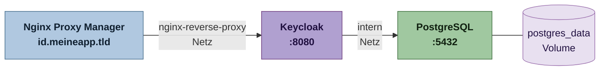

# Keycloak

[Keycloak](https://www.keycloak.org/) ist der zentrale Identity Provider des Projekts. Er übernimmt Login, Token-Ausgabe und Rollenverwaltung nach dem OpenID-Connect-Standard. Alle anderen Dienste – Frontend, Microservices und CIB seven – vertrauen ausschließlich den von Keycloak ausgestellten JWTs. Die Konzepte dahinter beschreibt die [OAuth2/OIDC-Seite](./oauth2-oidc).

Im Projekt läuft Keycloak unter **`id.meineapp.tld`**, bereitgestellt über den [Nginx Proxy Manager](./reverse-proxy).


## Warum PostgreSQL?

Keycloak bringt eine eingebettete H2-Datenbank mit, die jedoch ausdrücklich nur für Entwicklung und Tests geeignet ist. Für den produktiven Betrieb **muss** eine externe Datenbank verwendet werden – wir nutzen **PostgreSQL**.



Keycloak und PostgreSQL teilen ein internes Docker-Netzwerk (`intern`). Nach außen – zum Nginx Proxy Manager – ist nur Keycloak erreichbar; PostgreSQL bleibt vollständig intern.

## Docker Compose

```yaml
services:
  keycloak:
    image: quay.io/keycloak/keycloak:26.2
    command: start
    environment:
      # Datenbankanbindung
      KC_DB: postgres
      KC_DB_URL: jdbc:postgresql://postgres:5432/keycloak
      KC_DB_USERNAME: keycloak
      KC_DB_PASSWORD: ${KC_DB_PASSWORD}
      # Öffentlicher Hostname (muss zur Subdomain im Nginx PM passen)
      KC_HOSTNAME: id.meineapp.tld
      # TLS wird am Nginx PM terminiert, Keycloak läuft intern per HTTP
      KC_HTTP_ENABLED: "true"
      KC_PROXY_HEADERS: xforwarded
      # Initialer Admin-Account (nur beim ersten Start ausgewertet)
      KEYCLOAK_ADMIN: admin
      KEYCLOAK_ADMIN_PASSWORD: ${KEYCLOAK_ADMIN_PASSWORD}
    depends_on:
      postgres:
        condition: service_healthy
    networks:
      - nginx-reverse-proxy   # erreichbar für den Nginx Proxy Manager
      - intern                # erreichbar für PostgreSQL

  postgres:
    image: postgres:16
    environment:
      POSTGRES_DB: keycloak
      POSTGRES_USER: keycloak
      POSTGRES_PASSWORD: ${KC_DB_PASSWORD}
    volumes:
      - postgres_data:/var/lib/postgresql/data
    healthcheck:
      test: ["CMD-SHELL", "pg_isready -U keycloak"]
      interval: 10s
      timeout: 5s
      retries: 5
    networks:
      - intern                # nur intern, kein Zugriff von außen

networks:
  nginx-reverse-proxy:
    external: true            # existiert bereits auf dem Host
  intern:
    driver: bridge            # vom Stack verwaltet

volumes:
  postgres_data:              # Daten überleben Container-Neustarts
```

:::warning[Standard-Netzwerk und Ports]
Keycloak ist in zwei Netzwerken eingetragen (`nginx-reverse-proxy` + `intern`). Damit gilt das automatische Standard-Netzwerk nicht mehr – genau deshalb hat PostgreSQL seinen eigenen Eintrag unter `intern`. Kein Dienst darf einen `ports:`-Eintrag haben; die Kommunikation läuft ausschließlich über die Docker-Netzwerke. Hintergründe dazu auf der [Nginx Proxy Manager-Seite](./reverse-proxy#docker-netzwerk-einrichten).
:::

### Umgebungsvariablen (`.env`)

Sensible Werte werden nicht in die `docker-compose.yml` geschrieben, sondern in einer `.env`-Datei neben der Compose-Datei abgelegt (nicht ins Git einchecken):

```env
KC_DB_PASSWORD=sicheres_passwort
KEYCLOAK_ADMIN_PASSWORD=sicheres_admin_passwort
```

## Proxy-Host im Nginx Proxy Manager

Im Nginx Proxy Manager wird ein Proxy-Host für Keycloak angelegt:

| Feld | Wert |
|---|---|
| Domain Names | `id.meineapp.tld` |
| Scheme | `http` |
| Forward Hostname / IP | `keycloak` (Docker-Servicename) |
| Forward Port | `8080` |
| SSL Certificate | Let's Encrypt (automatisch) |

Der Servicename `keycloak` wird von Docker intern aufgelöst, weil Nginx Proxy Manager und der Keycloak-Container im selben Netzwerk `nginx-reverse-proxy` liegen.

## Datenpersistenz

PostgreSQL speichert alle Daten im **named Volume** `postgres_data`. Das Volume wird von Docker verwaltet und überlebt Container-Neustarts sowie `docker compose down`. Nur `docker compose down -v` würde es löschen.

:::danger[Volume nicht löschen]
Ein `docker compose down -v` löscht alle Volumes des Stacks – und damit sämtliche Nutzer, Realms und Konfigurationen in Keycloak. Im produktiven Betrieb immer ohne `-v` arbeiten.
:::

## Weiterführende Seiten

- [Nginx Proxy Manager](./reverse-proxy) – Netzwerk und Proxy-Host-Konfiguration
- [OAuth2 und OIDC](./oauth2-oidc) – Login-Flow und Token-Validierung
- [Deployment mit Portainer](./deployment) – Stack einrichten und aktualisieren
