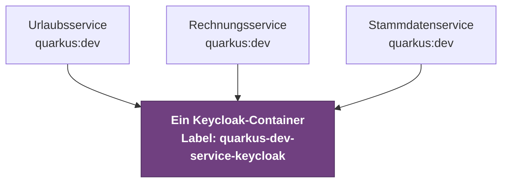
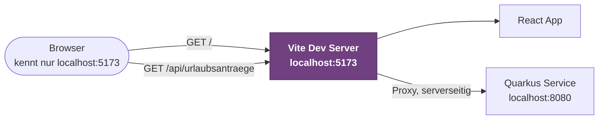

# Lokal entwickeln

Die [Setup-Seite](./setup) beschreibt, was ihr einmalig installiert. Diese Seite beschreibt den Alltag danach.

Die wichtigste Nachricht vorweg: **Niemand braucht das gesamte System lokal.** Ihr müsst weder PostgreSQL noch Keycloak installieren, und ihr müsst auch nicht die Services der anderen Teams starten, um an eurem eigenen zu arbeiten. Quarkus nimmt euch das ab.

## In drei Schritten zum laufenden Service

```bash
docker info          # prüfen, dass Docker läuft
cd services/urlaub   # in euren Service wechseln
./mvnw quarkus:dev   # starten
```

Wer die [Quarkus CLI](https://quarkus.io/guides/cli-tooling) installiert hat, schreibt stattdessen nur `quarkus dev`.

Beim ersten Start dauert das etwas, weil Container-Images geladen werden. Danach passiert Folgendes automatisch:

| Was | Wo |
|---|---|
| Euer Service | `http://localhost:8080` |
| Dev UI | `http://localhost:8080/q/dev-ui` |
| PostgreSQL-Container | wird gestartet und verdrahtet |
| Keycloak-Container | wird gestartet und verdrahtet |

Ihr habt an dieser Stelle eine vollständige Entwicklungsumgebung, ohne eine einzige Zugangsdatei angelegt zu haben.

## Dev Mode und Live Reload

Der [Dev Mode](https://quarkus.io/guides/maven-tooling#dev-mode) ist kein Server, den ihr nach jeder Änderung neu startet. Ihr speichert die Datei, ladet den Browser neu, und Quarkus hat den geänderten Code bereits übernommen. Das gilt auch für Änderungen an der `application.properties`.

In der Konsole steuert ihr den laufenden Dev Mode über Tastenkürzel:

| Taste | Wirkung |
|---|---|
| `h` | Alle verfügbaren Befehle anzeigen |
| `r` | Continuous Testing starten oder anhalten |
| `d` | Dev UI im Browser öffnen |
| `w` | Die Anwendung im Browser öffnen |
| `s` | Neustart erzwingen |
| `q` | Beenden |

:::tip[Den Dev Mode laufen lassen]
Beendet ihn nicht nach jeder Änderung. Er ist dafür gebaut, den ganzen Arbeitstag zu laufen. Ein Neustart ist nur nötig, wenn ihr Abhängigkeiten in der `pom.xml` ändert.
:::

## Dev Services: Datenbank und Keycloak ohne Installation

[Dev Services](https://quarkus.io/guides/dev-services) startet die Infrastruktur, die euer Service braucht, automatisch als Container, sobald die zugehörige Verbindung **nicht konfiguriert ist**. Intern läuft das über [Testcontainers](https://java.testcontainers.org/).

Der entscheidende Punkt ist die Bedingung „nicht konfiguriert". Genau deshalb ist die [`application.properties`](./microservices#konfiguration) im Projekt fast leer, und genau deshalb soll sie das bleiben:

```properties title="src/main/resources/application.properties"
# Hibernate verwaltet das Schema
quarkus.hibernate-orm.database.generation=update

# Im Test mit leerem Schema starten
%test.quarkus.hibernate-orm.database.generation=drop-and-create
```

Weder Datenbank-URL noch `auth-server-url` stehen darin. In Produktion kommen sie über [Umgebungsvariablen](./microservices#konfiguration-in-produktion) wie `QUARKUS_DATASOURCE_JDBC_URL` herein, lokal ist damit nichts gesetzt, und Quarkus startet die Container selbst.

:::warning[Die Datei nicht mit Platzhaltern füllen]
Etwas wie `quarkus.datasource.jdbc.url=${DB_URL}` in die Datei zu schreiben sieht harmlos aus, kostet euch aber genau diesen Komfort: Die Einstellung gilt damit als gesetzt, Dev Services springt nicht mehr an, und ihr müsst PostgreSQL wieder von Hand betreiben.
:::

Die Details zu den einzelnen Diensten stehen in den Guides zu [Dev Services für Datenbanken](https://quarkus.io/guides/databases-dev-services) und [Dev Services für Keycloak](https://quarkus.io/guides/security-openid-connect-dev-services).

:::warning[Docker muss laufen]
Ohne laufende Container-Runtime scheitert der Start mit einer Meldung über eine nicht gefundene Docker-Umgebung. Das ist der mit Abstand häufigste Fehler beim ersten Versuch. Die Installation beschreibt die [Setup-Seite](./setup#docker).
:::

### Ein Keycloak für alle Services

Arbeitet ihr an mehreren Services gleichzeitig, würde naiv gedacht jeder seinen eigenen Keycloak starten. Das passiert nicht: Keycloak Dev Services erkennt einen bereits laufenden Container am Label `quarkus-dev-service-keycloak` und **teilt ihn standardmäßig** zwischen allen lokal laufenden Quarkus-Anwendungen.

Drei parallel laufende Services bedeuten also einen Keycloak, nicht drei:



Der zuerst gestartete Service bringt den Container hoch, alle weiteren finden ihn über das Label und hängen sich an. Ihr müsst dafür nichts konfigurieren. Abschalten ließe sich das Verhalten über `quarkus.keycloak.devservices.shared=false`, aber das wollt ihr in diesem Projekt nicht.

### Euer eigenes Realm lokal verwenden

Standardmäßig legt der Keycloak Dev Service ein Realm mit den Testnutzern `alice` und `bob` an. Sobald ihr eigene Rollen benutzt, reicht das nicht mehr, und es entsteht der Klassiker: Auf dem Server greift die Berechtigung, lokal nicht.

Die Lösung ist eine Realm-Datei im Repository:

```properties
quarkus.keycloak.devservices.realm-path=winfprojekt-realm.json
```

Liegt die Datei unter `src/main/resources/`, importiert der Dev Service sie beim Start. Damit entwickelt das ganze Team gegen dieselben Rollen, Clients und Testnutzer wie auf dem Server, und die Definition liegt versioniert im Git statt in der Erinnerung einer einzelnen Person.

Ein Realm exportiert ihr aus der Keycloak-Adminkonsole unter **Realm settings**, Menü **Action**, **Partial export**. Nehmt Clients und Rollen mit, aber keine echten Nutzerdaten.

:::warning[Keine echten Zugangsdaten in die Realm-Datei]
Die Datei landet im öffentlichen Repository. Sie darf ausschließlich Testnutzer mit offensichtlichen Testpasswörtern enthalten, niemals Passwörter oder Client Secrets aus der Produktivumgebung.
:::

## Die Dev UI

Unter `http://localhost:8080/q/dev-ui` liegt der Werkzeugkasten, den die meisten übersehen. Was dort alles steckt, beschreibt der Guide [Dev UI](https://quarkus.io/guides/dev-ui):

| Bereich | Wofür |
|---|---|
| **Configuration** | Alle wirksamen Konfigurationswerte einsehen und im laufenden Betrieb ändern |
| **OpenID Connect** | Sich am Keycloak Dev Service anmelden und geschützte Endpunkte ausprobieren |
| **Dev Services** | Sehen, welche Container laufen und unter welchen Zugangsdaten |
| **Continuous Testing** | Testergebnisse live mitverfolgen |

Wie ihr darüber geschützte Endpunkte manuell testet, steht auf der [Testing-Seite](./testing#login-in-den-keycloak-dev-service).

## In die Datenbank schauen

Früher oder später wollt ihr wissen, was tatsächlich in der Datenbank steht. Etwa weil Hibernate ein Schema anders angelegt hat als erwartet, oder weil ein Datensatz nicht so aussieht wie gedacht. Der Dev-Service-Container ist dafür ganz normal erreichbar, ihr müsst nur die Zugangsdaten kennen.

### Zugangsdaten finden

Der einfachste Weg führt über die **Dev UI**: Unter `http://localhost:8080/q/dev-ui` zeigt die Karte **Dev Services** die vollständige JDBC-URL samt Benutzername und Passwort des laufenden Containers an. Alternativ verrät `docker ps` den Port, auf den der Container nach außen gemappt ist.

Der Haken daran: Dev Services vergibt standardmäßig bei jedem Start einen **zufälligen Port**. Eine einmal gespeicherte Verbindung im Datenbankwerkzeug funktioniert dann beim nächsten Mal nicht mehr. Deshalb lohnt sich ein fester Port für die Entwicklung:

```properties
%dev.quarkus.datasource.devservices.port=5432
```

Damit ist die Verbindung dauerhaft `jdbc:postgresql://localhost:5432/...` und ihr richtet sie im Werkzeug genau einmal ein.

### IntelliJ IDEA

IntelliJ bringt in der **Ultimate Edition** ein Datenbankwerkzeug mit, das für diesen Zweck vollkommen ausreicht:

1. **View**, **Tool Windows**, **Database** öffnen
2. Über **+** eine **Data Source** vom Typ **PostgreSQL** anlegen
3. Host `localhost`, Port wie oben festgelegt, Datenbank, Benutzer und Passwort aus der Dev UI übernehmen
4. Beim ersten Mal den PostgreSQL-Treiber herunterladen lassen, dann **Test Connection**

Danach seht ihr die Tabellen im Projektbaum, könnt Daten direkt ansehen und eigene SQL-Abfragen ausführen. Die Einrichtung der IDE beschreibt die [Setup-Seite](./setup#ide-intellij-idea).

:::note[Community Edition hat kein Datenbankwerkzeug]
Das Database-Fenster gibt es nur in der Ultimate Edition. Studierende erhalten sie kostenlos über die [JetBrains-Lizenz für Bildungseinrichtungen](https://www.jetbrains.com/community/education/). Wer die Community Edition nutzt, greift zu einem der folgenden Werkzeuge.
:::

### Alternativen

| Werkzeug | Anmerkung |
|---|---|
| [DBeaver Community](https://dbeaver.io/) | Kostenlos, plattformübergreifend, funktioniert genauso |
| [pgAdmin](https://www.pgadmin.org/) | Speziell für PostgreSQL, umfangreicher, aber schwergewichtiger |
| `psql` im Container | Ohne Installation: Container mit `docker ps` heraussuchen, dann `docker exec -it <container> psql -U quarkus -d quarkus` |

:::warning[Die Daten sind flüchtig]
Der Dev-Service-Container wird verworfen, wenn ihr ihn entfernt, und mit `%test.quarkus.hibernate-orm.database.generation=drop-and-create` startet jeder Testlauf ohnehin mit leerem Schema. Alles, was ihr dort von Hand anlegt, ist Wegwerfware. Testdaten, die ihr regelmäßig braucht, gehören als Import-Skript ins Repository.
:::

## Continuous Testing

Im Dev Mode startet ihr mit `r` die [kontinuierliche Testausführung](https://quarkus.io/guides/continuous-testing). Nach jedem Speichern laufen nur die Tests, die vom geänderten Code betroffen sind. Ihr merkt damit innerhalb von Sekunden, wenn ihr etwas kaputt gemacht habt, statt es im Pull Request zu erfahren. Was ihr dafür schreibt, beschreibt die [Testing-Seite](./testing).

## Mehrere Services gleichzeitig starten

Alle Services belegen standardmäßig Port 8080, was beim zweiten Start scheitert. Vergebt deshalb pro Service einen festen Port, nur für das Dev-Profil. Das `%dev.`-Präfix ist ein [Konfigurationsprofil](https://quarkus.io/guides/config-reference#profiles) und bedeutet, dass die Zeile ausschließlich im Dev Mode gilt:

```properties
%dev.quarkus.http.port=8081
```

Haltet die Zuordnung im Team fest, damit alle dieselbe Vorstellung davon haben, was wo läuft:

| Service | Port |
|---|---|
| Urlaubsservice | 8080 |
| Rechnungsservice | 8081 |
| Stammdatenservice | 8082 |

## Frontend gegen lokales Backend

Startet ihr das [React-Frontend](./frontend) mit `npm run dev`, läuft es auf Port 5173 und der Service auf 8080. Ein direkter Aufruf scheitert dann an CORS.

Die richtige Lösung ist **nicht**, CORS im Backend aufzuweichen, sondern der [Proxy des Vite-Entwicklungsservers](https://vite.dev/config/server-options#server-proxy):

```ts title="vite.config.ts"
export default defineConfig({
  plugins: [react()],
  server: {
    proxy: {
      '/api': {
        target: 'http://localhost:8080',
        changeOrigin: true,
        rewrite: (path) => path.replace(/^\/api/, ''),
      },
    },
  },
});
```

Im Anwendungscode ruft ihr dann `/api/urlaubsantraege` auf:



Der entscheidende Punkt ist die linke Seite: Der Browser spricht ausschließlich mit Port 5173. Die Weiterleitung auf 8080 passiert im Vite-Server, also serverseitig und außerhalb der Reichweite der Same-Origin-Regel. Für den Browser kommt alles von derselben Adresse, CORS entfällt. In Produktion zeigt `VITE_API_URL` weiterhin auf die echte Subdomain hinter dem [Reverse Proxy](./reverse-proxy).

## Was Dev Services nicht abdeckt

Für alles, was kein Quarkus kennt, braucht ihr eine Entscheidung. Der Leitgedanke bleibt: so wenig wie möglich lokal betreiben.

| Fall | Empfehlung |
|---|---|
| **CIB seven** | Eigenes `docker-compose.yml` für lokal, oder gegen die Instanz auf dem Server arbeiten. Details auf der [CIB seven-Seite](./cibseven) |
| **Service eines anderen Teams** | Gegen die Testumgebung zeigen lassen. Nur wenn das nicht geht, mit der [WireMock-Extension](https://docs.quarkiverse.io/quarkus-wiremock/dev/index.html) die Antworten nachstellen |
| **Externe API** | Ebenfalls WireMock, damit eure Tests nicht vom Netz abhängen |

## Wenn es nicht startet

| Symptom | Ursache und Lösung |
|---|---|
| `Could not find a valid Docker environment` | Docker läuft nicht. Docker Desktop starten und mit `docker info` prüfen |
| `Port 8080 already in use` | Ein anderer Dev Mode läuft noch. Beenden, oder `%dev.quarkus.http.port` setzen |
| Login schlägt nach Änderung der Realm-Datei fehl | Der geteilte Keycloak-Container läuft noch mit dem alten Realm. Mit `docker ps --filter label=quarkus-dev-service-keycloak` finden und entfernen |
| Änderungen wirken nicht | Bei Änderungen an der `pom.xml` greift Live Reload nicht. Dev Mode neu starten |
| Erster Start dauert sehr lange | Die Container-Images werden geladen. Das passiert nur einmal pro Image-Version |
| Datenbank enthält alte Testdaten | Der Dev-Service-Container lebt über Neustarts hinweg. Container entfernen, dann startet er leer |

## Offizielle Dokumentation

Alles auf dieser Seite ist eine auf dieses Projekt zugeschnittene Auswahl. Die vollständige Referenz steht bei Quarkus:

| Thema | Guide |
|---|---|
| Dev Mode und Live Reload | [Maven Tooling](https://quarkus.io/guides/maven-tooling#dev-mode) |
| Dev Services im Überblick | [Dev Services](https://quarkus.io/guides/dev-services) |
| Datenbank-Container | [Dev Services for Databases](https://quarkus.io/guides/databases-dev-services) |
| Keycloak-Container und Realm-Import | [Dev Services and Dev UI for OIDC](https://quarkus.io/guides/security-openid-connect-dev-services) |
| Die Dev UI | [Dev UI](https://quarkus.io/guides/dev-ui) |
| Tests im Hintergrund | [Continuous Testing](https://quarkus.io/guides/continuous-testing) |
| Konfigurationsprofile wie `%dev.` und `%test.` | [Configuration Reference, Profiles](https://quarkus.io/guides/config-reference#profiles) |
| Wie Umgebungsvariablen auf Properties abgebildet werden | [Configuration Reference, Environment variables](https://quarkus.io/guides/config-reference#environment-variables) |
| Jede einzelne Einstellung | [All Configuration Options](https://quarkus.io/guides/all-config) |
| Die Kommandozeile | [Quarkus CLI](https://quarkus.io/guides/cli-tooling) |
