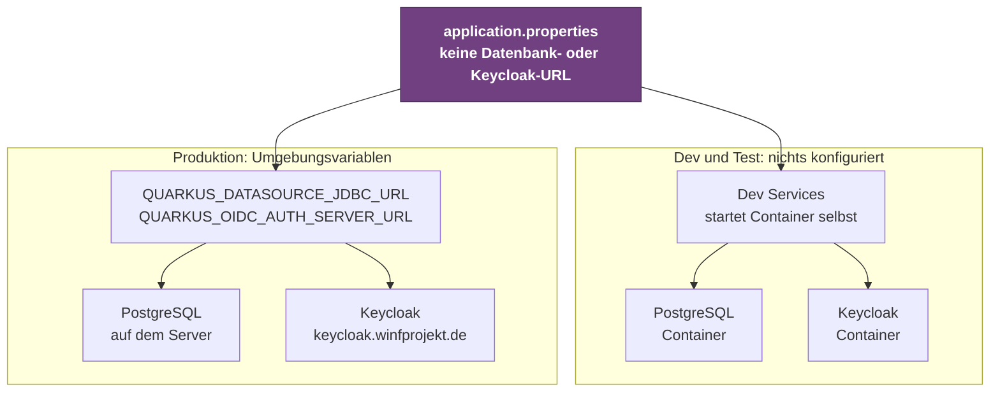

# Microservices mit Quarkus

Die fachliche Logik ist auf spezialisierte Microservices aufgeteilt, die jeweils mit [Quarkus](https://quarkus.io/) implementiert sind. Quarkus bietet kurze Startup-Zeiten, geringen Speicherbedarf und eine moderne, auf CDI und MicroProfile basierende Entwicklungserfahrung. Wie die Services in die Gesamtarchitektur eingebettet sind, ist auf der [Systemarchitektur-Seite](./architektur) beschrieben.

## Neuen Service anlegen

Neue Services werden über [code.quarkus.io](https://code.quarkus.io/) initialisiert. Dort lassen sich Extensions auswählen und ein fertiges Maven-Projekt herunterladen. Das Projekt landet anschließend als eigener Unterordner im [Monorepo](./github).

## Extensions

Ein klassischer Service im Projekt braucht die folgenden fünf Extensions:


| Extension | Artifact ID | Zweck |
|-----------|-------------|-------|
| **Hibernate ORM with Panache** | `quarkus-hibernate-orm-panache` | Datenbankzugriff mit Active Record oder Repository Pattern |
| **REST Jackson** | `quarkus-rest-jackson` | REST-Endpunkte mit JSON-Serialisierung via Jackson |
| **SmallRye Health** | `quarkus-smallrye-health` | Health-Checks (`/q/health`) für Liveness und Readiness |
| **JDBC Driver - PostgreSQL** | `quarkus-jdbc-postgresql` | PostgreSQL-Datenbankverbindung via JDBC |
| **OpenID Connect** | `quarkus-oidc` | Token-Validierung und Authentifizierung via Keycloak |

### Warum diese Kombination?

- **Hibernate + PostgreSQL** bilden den Persistenz-Stack. Panache reduziert Boilerplate beim Datenbankzugriff deutlich.
- **REST Jackson** stellt die REST-API bereit und serialisiert Java-Objekte automatisch als JSON.
- **SmallRye Health** ermöglicht Portainer und dem [NGINX Proxy Manager](./architektur#nginx-proxy-manager-reverse-proxy) zu prüfen, ob der Service läuft.
- **OpenID Connect** bindet [Keycloak](./oauth2-oidc) an: Eingehende Bearer-Tokens werden automatisch validiert, ohne dass dafür eigener Code nötig ist.

## Konfiguration

Die `src/main/resources/application.properties` bleibt bewusst fast leer:

```properties title="src/main/resources/application.properties"
# Hibernate verwaltet das Schema
quarkus.hibernate-orm.database.generation=update

# Im Test mit leerem Schema starten
%test.quarkus.hibernate-orm.database.generation=drop-and-create
```

Das ist keine gekürzte Fassung, sondern die vollständige Konfiguration. Alles Weitere ergibt sich aus den Voreinstellungen:

| Was nicht dasteht | Warum es nicht nötig ist |
|---|---|
| `quarkus.datasource.db-kind` | Wird aus der Treiber-Extension abgeleitet. Nur bei **mehreren** Datenbank-Extensions im Projekt muss die Art angegeben werden |
| `quarkus.oidc.application-type` | `service` ist die Voreinstellung und genau das, was ein Bearer-Token-Service braucht |
| Datenbank- und Keycloak-URL | Kommen in Produktion aus Umgebungsvariablen, siehe unten. In Dev und Test übernimmt [Dev Services](./lokale-entwicklung#dev-services-datenbank-und-keycloak-ohne-installation) |

Dasselbe Artefakt läuft damit in beiden Umgebungen, ohne dass ihr etwas umschaltet. Woher die Verbindungsdaten kommen, entscheidet allein die Umgebung:



### Konfiguration in Produktion

Quarkus liest jede Einstellung auch aus einer Umgebungsvariablen. Die Umrechnung ist mechanisch: Jedes Zeichen, das weder alphanumerisch noch ein Unterstrich ist, wird zum Unterstrich, danach wird alles großgeschrieben. Für unsere Properties heißt das schlicht, dass Punkte und Bindestriche zu Unterstrichen werden.

```text
quarkus.datasource.jdbc.url   →   QUARKUS_DATASOURCE_JDBC_URL
quarkus.oidc.auth-server-url  →   QUARKUS_OIDC_AUTH_SERVER_URL
```

Die verbindliche Regel steht im Quarkus-Guide unter [Configuration Reference, Abschnitt Environment variables](https://quarkus.io/guides/config-reference#environment-variables).

Ihr müsst die Werte deshalb **gar nicht** in die `application.properties` schreiben, auch nicht als Platzhalter. Es genügt, die passenden Variablen im [Deployment](./deployment) am Container zu setzen:

| Umgebungsvariable | Beispielwert |
|---|---|
| `QUARKUS_DATASOURCE_JDBC_URL` | `jdbc:postgresql://db:5432/urlaub` |
| `QUARKUS_DATASOURCE_USERNAME` | `urlaub` |
| `QUARKUS_DATASOURCE_PASSWORD` | aus dem Secret |
| `QUARKUS_OIDC_AUTH_SERVER_URL` | `https://keycloak.winfprojekt.de/realms/winfprojekt` |
| `QUARKUS_OIDC_CLIENT_ID` | `urlaubsservice` |

Der Gewinn ist doppelt: Passwörter und URLs landen nie im Repository, und weil in der Datei nichts steht, startet Quarkus in Dev und Test automatisch die passenden Container. Dieselbe Konvention gilt für **jede** Quarkus-Einstellung. Wollt ihr in Produktion den Port ändern, setzt ihr `QUARKUS_HTTP_PORT`, ohne eine Zeile Code anzufassen.

:::warning[Keine eigenen Variablennamen erfinden]
Schreibt nicht `quarkus.datasource.password=${DB_PASSWORD}` in die Datei, um dann `DB_PASSWORD` zu setzen. Das ist ein Zwischenschritt, den Quarkus nicht braucht, und er kostet euch die Dev Services, weil die Einstellung damit in allen Profilen als gesetzt gilt.
:::

Was ihr davon im Alltag habt, von der geteilten Keycloak-Instanz bis zum Blick in die Datenbank, beschreibt die Seite [Lokal entwickeln](./lokale-entwicklung). Wie ihr Dev Services in Tests nutzt, steht auf der [Testing-Seite](./testing).

### Datenbankschema und Migrationen

Solange es möglich ist, wird auf Flyway-Migrationen verzichtet. Stattdessen übernimmt Hibernate mit `database.generation=update` das Anpassen des Schemas automatisch. Das reduziert den Verwaltungsaufwand erheblich und reicht für den frühen Projektzeitraum aus, solange keine inkompatiblen Schemaänderungen nötig sind.

:::warning
`database.generation=update` eignet sich nicht für Produktivsysteme mit wertvollen Daten. Sobald Spalten umbenannt, Typen geändert oder Daten migriert werden müssen, ist Flyway der richtige Weg.
:::

## Versionierung und Deployment

Jeder Service wird eigenständig versioniert nach [Semantic Versioning](./semver). Ein Git-Tag mit `v`-Präfix löst die CI/CD-Pipeline aus, die ein Docker-Image baut und in die GitHub Container Registry veröffentlicht. Wie das Image dann auf dem Server landet, beschreibt die [Deployment-Seite](./deployment).
