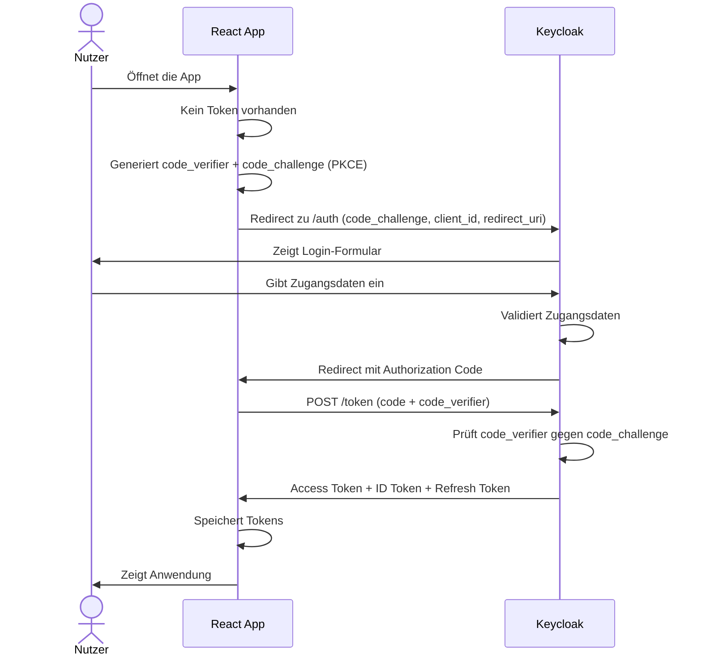
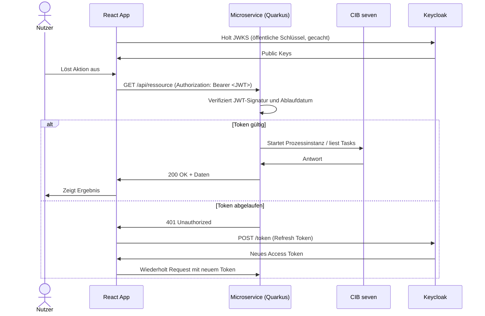

# OAuth2 und OIDC

Das System verwendet **OpenID Connect (OIDC)** für Authentifizierung und **OAuth2** für Autorisierung. Keycloak ist der zentrale Identity Provider. Alle Komponenten, die auf gesicherte Ressourcen zugreifen, interagieren über dieses Protokoll.

## Begriffe

**OAuth2** ist ein Autorisierungsframework: Es legt fest, wie ein Client im Namen eines Nutzers Zugriff auf Ressourcen erhält, ohne dessen Passwort zu kennen. Das Ergebnis ist ein **Access Token**.

**OpenID Connect** baut auf OAuth2 auf und ergänzt Authentifizierung: Der Client erhält zusätzlich ein **ID Token**, das Informationen über die eingeloggte Person enthält (Name, E-Mail, Rollen).

## Tokens

| Token | Format | Verwendung |
|---|---|---|
| **Access Token** | JWT | Wird bei jedem API-Aufruf als `Authorization: Bearer` mitgeschickt |
| **ID Token** | JWT | Enthält Nutzerinfo für die React-App (Name, Rollen) |
| **Refresh Token** | opaque | Erneuert das Access Token ohne erneuten Login |

## Login-Flow (Authorization Code + PKCE)

Die React-App nutzt den **Authorization Code Flow mit PKCE** (Proof Key for Code Exchange), den empfohlenen Flow für Single Page Applications ohne sicheres Backend-Secret. Alle Anfragen laufen über NGINX, der als transparenter Reverse Proxy fungiert und im Ablauf nicht sichtbar ist.

## API-Aufruf mit Token-Validierung

Nach dem Login schickt die React-App das Access Token bei jedem Aufruf mit. Der Microservice als Resource Server validiert das Token eigenständig über den öffentlichen Schlüssel von Keycloak (JWKS), ohne Keycloak bei jeder Anfrage kontaktieren zu müssen.

## Rollen und Zugriffssteuerung

Keycloak verwaltet Rollen, die im JWT als Claims enthalten sind. Die Microservices lesen diese Claims aus und entscheiden damit, welche Aktionen ein Nutzer ausführen darf. Die React-App liest die Rollen aus dem ID Token und blendet Funktionen entsprechend ein oder aus.
