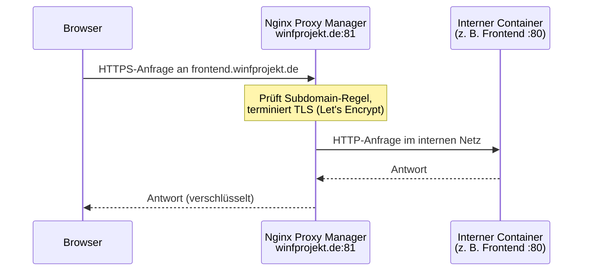

# Nginx Proxy Manager

[Nginx Proxy Manager](https://nginxproxymanager.com/) ist der Reverse Proxy des Projekts. Alle Dienste laufen hinter ihm – er ist der einzige Punkt, der aus dem Internet erreichbar ist.

## Wie es funktioniert

Ein Reverse Proxy nimmt eingehende Anfragen entgegen und leitet sie anhand von Regeln (hier: Subdomains) an den richtigen internen Dienst weiter. Für den Client sieht es so aus, als würde er direkt mit dem Dienst reden – die interne Struktur bleibt verborgen.



Nginx Proxy Manager übernimmt dabei auch die TLS-Terminierung: Er besorgt automatisch ein Let's-Encrypt-Zertifikat und kommuniziert intern per unverschlüsseltem HTTP mit den Containern.

## Verwaltungsoberfläche

Die Weboberfläche ist unter **[http://winfprojekt.de:81](http://winfprojekt.de:81)** erreichbar. Dort werden Proxy-Hosts, SSL-Zertifikate und Weiterleitungen konfiguriert – ohne manuelle nginx-Konfigurationsdateien.


Jede Zeile in der Übersicht entspricht einem Proxy-Host: links die öffentliche Subdomain, rechts das interne Ziel (Containername und Port) sowie der SSL-Status.

Die offizielle Dokumentation ist unter [nginxproxymanager.com](https://nginxproxymanager.com/) zu finden.

## Docker-Netzwerk einrichten

Damit Nginx Proxy Manager einen Container erreichen kann, müssen beide im selben Docker-Netzwerk liegen. Dieses Netzwerk heißt `nginx-reverse-proxy` und ist ein **externes Netzwerk** – es existiert auf dem Host unabhängig von einzelnen Stacks.

:::warning[Standard-Netzwerk wird deaktiviert]
Sobald ein Container einem externen Netzwerk zugewiesen wird, ist er **nicht mehr** automatisch im Standard-Netzwerk des Compose-Stacks erreichbar. Dienste, die sich gegenseitig ansprechen müssen (z. B. Backend und Datenbank), müssen **beide** im selben Netzwerk oder explizit mehreren Netzwerken aufgeführt sein.
:::

### Beispiel `docker-compose.yml`

```yaml
services:
  mein-service:
    image: ghcr.io/org/mein-service:1.2.0
    networks:
      - nginx-reverse-proxy
      - intern          # eigenes internes Netz für Kommunikation mit DB etc.

  datenbank:
    image: postgres:16
    networks:
      - intern          # nur intern, kein Zugriff vom Proxy nötig

networks:
  nginx-reverse-proxy:
    external: true      # Netz existiert bereits auf dem Host
  intern:
    driver: bridge      # wird vom Stack selbst verwaltet
```

Das externe Netzwerk muss **einmalig auf dem Host** angelegt werden, bevor der erste Stack damit gestartet wird:

```bash
docker network create nginx-reverse-proxy
```

In Portainer geschieht das unter **Networks → Add network**. Details zum Stack-Deployment in Portainer finden sich auf der [Deployment-Seite](./deployment).

## Proxy-Host anlegen

Nachdem der Container im richtigen Netzwerk läuft, wird in der Weboberfläche ein neuer Proxy-Host angelegt:

| Feld | Beispielwert |
|---|---|
| Domain Names | `mein-service.winfprojekt.de` |
| Scheme | `http` |
| Forward Hostname / IP | `mein-service` (Docker-Servicename) |
| Forward Port | Port, auf dem der Container intern lauscht (z. B. `8080`, `3000`, `80`) |
| SSL Certificate | Let's Encrypt (automatisch) |

Als Forward Hostname reicht der **Docker-Servicename** aus dem Compose-File – Docker löst ihn intern auf, solange sich Nginx Proxy Manager und der Container im gleichen Netzwerk befinden.

:::info[Kein `ports`-Mapping nötig]
Da die Kommunikation über das gemeinsame Docker-Netzwerk läuft, darf der Container-Port **nicht** per `ports:` nach außen exponiert werden. Ein `ports:`-Eintrag in der `docker-compose.yml` würde den Dienst direkt am Host-Port erreichbar machen und den Proxy umgehen.
:::

## Zusammenhang mit der Gesamtarchitektur

Nginx Proxy Manager ist der zentrale Eingangspunkt der [Systemarchitektur](./architektur). Alle im Projekt betriebenen Dienste – Frontend, Microservices, Keycloak und CIB seven – laufen hinter ihm. Das [Deployment](./deployment) über Portainer und das [Setup](./setup) der lokalen Entwicklungsumgebung bauen auf dieser Netzwerkstruktur auf.
